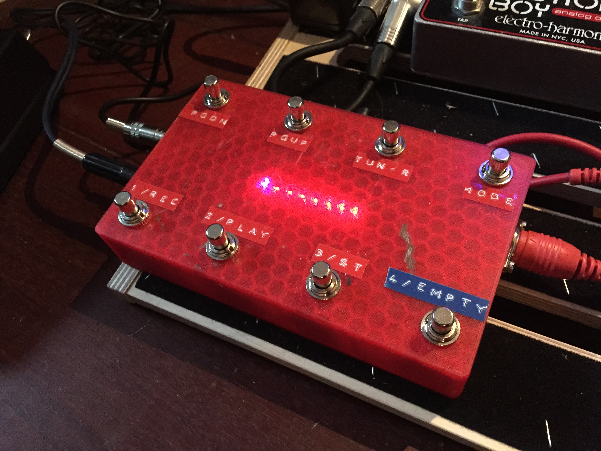

midi-footcontroller-arduino
---------------------------

License MPL v2.0, originally written by Jack Ha.

The foot controller has 2 expression pedal inputs and 8 momentary buttons and was made using an Arduino Uno. 

Preset mode:
Page Up, Page Down, Tuner, Mode
Preset 1, Preset 2, Preset 3, Preset 4

Looper mode (didn't use this in the video):
Direction switch, Octave switch, Tuner, Mode
Record, Play, Stop, Empty

media
-----

youtube
=======

https://www.youtube.com/watch?v=iySvyHlC4qQ

thingiverse
===========

http://www.thingiverse.com/thing:1132912

setup
-----

Make the thing. See Thingiverse.